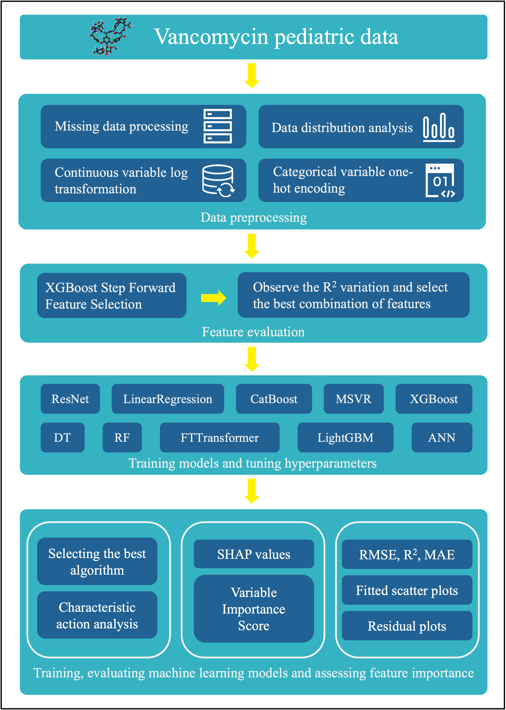

# Pedi-Vanco-MTR

👋Welcome to this repository!

Thanks for your attention and academic communication. All original codes for this study are publicly available here for reference and further exploration.

## 📊 Workflow Overview

## 📖 Project Description
This repository contains the complete analysis code for **pediatric vancomycin pharmacokinetic prediction**.
Based on machine learning and deep learning algorithms, this study aims to construct a multi-target regression model for predicting vancomycin clearance (CL) and volume of distribution (V) in children, facilitating individualized dosage optimization and therapeutic drug monitoring.

## 📂 Code Structure
- 🤖 `model_*.py`：Implementation of machine learning and deep learning prediction models
- 🔍`feature_selection.py`：Feature engineering, variable screening and correlation analysis
- 📈`rf_imputation_log_trans.py`：Random forest-based missing value imputation, as well as log transformation for continuous variables
